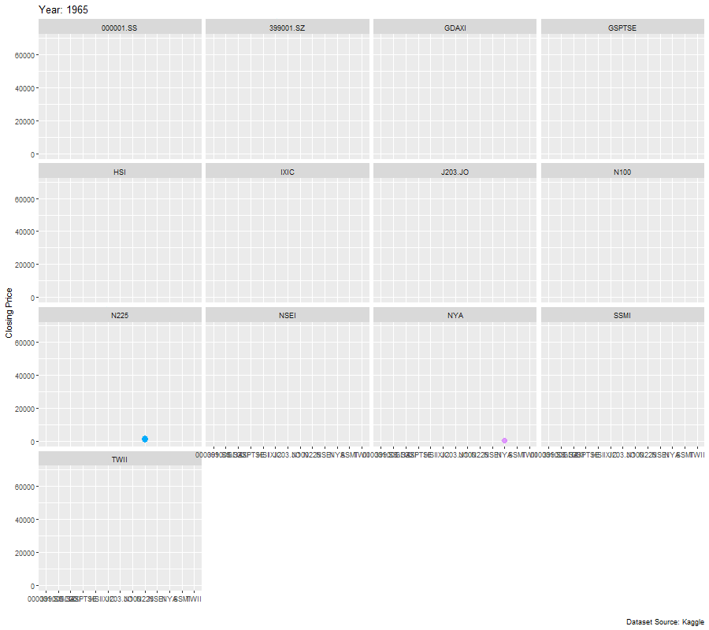
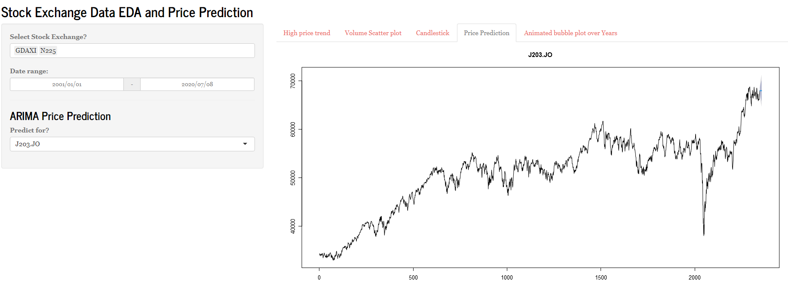

# Algorithmic design

## How does your systems work holistically?

We iteratively designed the shiny dashboard layout by adding new features on a weekly basis:

### First iteration implemented a simple line chart over a date range
  
```{r echo=FALSE, fig.align = 'center', out.width="100%", fig.cap="First iteration of our shiny app uses a simple dropdown box to select and plot only one index on the line chart over a set date range."}
knitr::include_graphics(rep("first iteration.JPG", 1))
```

### Second iteration added scatterplot showing the volume of trades made
  
```{r echo=FALSE, fig.align = 'center', out.width="100%", fig.cap="Our second iteration had us adding a scatter plot of the volume of trades made for a specific index over the same date range."}
knitr::include_graphics(rep("2nd iteration.png", 1))
```

### Third iteration implemented multiple plot of multiple indexes on the same chart
  
```{r echo=FALSE, fig.align = 'center', out.width="100%", fig.cap="For our third iteration we added a feature that would allow us plot graphs for multiple indexes on both plots over a date range."}
knitr::include_graphics(rep("2nd iteration multiple.png", 1))
```


### Final iteration added more charts and predictive modeling capabilities.
  
```{r echo=FALSE, fig.align = 'center', out.width="100%", fig.cap="For our final iteration we added a feature that would allow view each plot on different tabs on the Shiny App."}
knitr::include_graphics(rep("line_chart.png", 1))
```


```{r echo=FALSE, fig.align = 'center', out.width="100%", fig.cap="Scatter Plot."}
knitr::include_graphics(rep("scatter_plot.png", 1))
```


```{r echo=FALSE, fig.align = 'center', out.width="100%", fig.cap="Candlestick Plot that can span over different time frames (monthly, tri-monthly, semi-anunually, annually, tri-annually)."}
knitr::include_graphics(rep("candlestick_plot.png", 1))
```


```{r echo=FALSE, fig.align = 'center', fig.cap="Animated bubblestick plot that shows how stocks have progress accorss all indexes."}

```


```{r echo=FALSE, fig.align = 'center', out.width="100%", fig.cap="Price prediction plot us how stock prices might look in the future for the selected index."}


```


